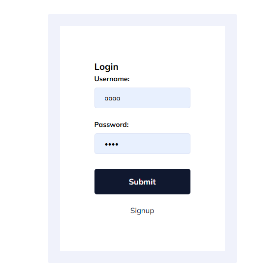
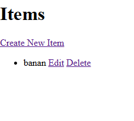

Referenced off of this youtube video: https://www.youtube.com/watch?v=OojA7SPViEs&t=85s

Thank you Rohan Yeloe for the help!

Didn't add any css to the crud application because I wanted to focus on making it work first

Login

Signup

Home

CRUD
View

Create

Edit

Delete

